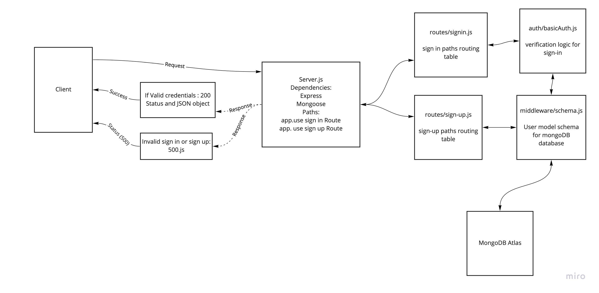

# Bearer Authorization

## URLs

### Heroku applications

[server-deploy-main](https://bearer-auth-dina.herokuapp.com/)

### Github actions

[actions](https://github.com/DinaSami/bearer-auth/actions)

### pull request

[PR](https://github.com/DinaSami/bearer-auth/pull/1)

## Drawings

### UML  



## Notes

### CI/CD (continuous integration , continuous deployment)

The "CI" refers to continuous integration, it is an automation process fro developers that means changes to an app is regularly built and merged to a repo, So that can be a good solutions when there are multiple branches of an app .

The "CD"  refers to continuous deployment , which is automatically release developer's changes from the repo to production , for exapmle we can use He

I install the app or library by typing (npm install -the library's name)

```
npm install express
```

I test the app or library by typing (npm test)

```
npm test 
```

I run the app by typing this command (nodemon)

I set up the app by typing this command (npm init -y)
